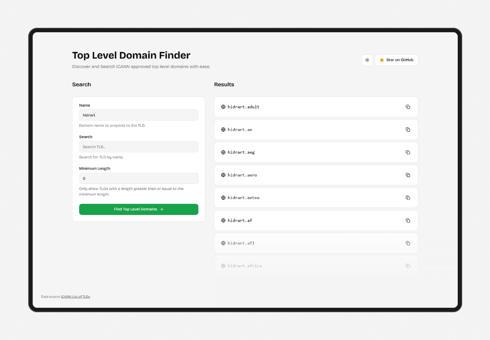

# TLD Finder

Search the comprehensive list of ICANN-approved Top-Level Domains. Filter by name to find specific TLDs quickly.



[Live Demo](https://tld-finder.vercel.app/)

## Features

-   Search through all ICANN-approved TLDs
-   Copy domain extensions with a single click
-   Light and dark theme support
-   Virtual list rendering for smooth performance with large datasets
-   Item snapping for improved scrolling experience

## Technology Stack

-   Next.js
-   Tailwind CSS
-   Shadcn UI
-   TypeScript
-   TanStack Virtual (React Virtual) for efficient list rendering

## Data Source

The data source is the [ICANN List of TLDs](https://data.iana.org/TLD/tlds-alpha-by-domain.txt).

## Getting Started

### Prerequisites

-   Node.js
-   pnpm (optional)

### Installation

1. Clone the repository:

    ```bash
    git clone https://github.com/hdytrfli/tld-finder.git
    cd tld-finder
    ```

2. Install dependencies:

    ```bash
    pnpm install
    ```

3. Run the development server:

    ```bash
    pnpm dev
    ```

4. Open [http://localhost:3000](http://localhost:3000) in your browser to see the app.

#### Building for Production

```bash
pnpm build
pnpm start
```

### How to Use

1. **Search**: Type in the search bar to filter TLDs by name.
2. **Copy**: Click on the TLD to copy it to your clipboard.

### License

[MIT License](LICENSE)

### Contributing

Contributions are welcome! Feel free to fork the repository and submit a pull request.
